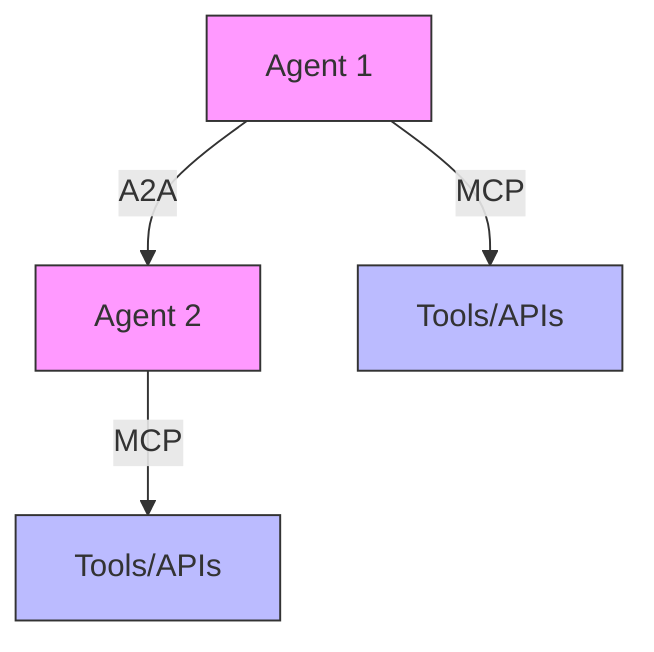

## Introduction
In the evolving landscape of AI applications, two protocols are becoming increasingly important: the Model Context Protocol (MCP) and the Agent2Agent (A2A) Protocol. While MCP enables agents to interact with tools and APIs, A2A facilitates communication and collaboration between different AI agents. Together, they form the foundation of modern agentic applications.

## Understanding A2A and MCP
Let's break down the roles of these two protocols:

### Model Context Protocol (MCP)
- Provides agents with access to tools and APIs
- Standardizes tool discovery and execution
- Enables consistent agent-tool interactions

### Agent2Agent Protocol (A2A)
- Enables agents to connect and collaborate
- Facilitates secure inter-agent communication
- Allows for team-based AI operations

## How A2A Works

### Core Concepts
1. **Agent Cards**
   - JSON-based representation of agent capabilities
   - Contains authentication information
   - Enables agent discovery and connection

2. **Communication Model**
   - Agents exchange context and task updates
   - No direct sharing of internal memory
   - Secure and structured data transfer

### Key Components

```json
{
    "agent_card": {
        "name": "ResearchAgent",
        "capabilities": [
            "web_search",
            "data_analysis",
            "report_generation"
        ],
        "authentication": {
            "type": "oauth2",
            "endpoint": "https://api.example.com/auth"
        },
        "communication_protocol": "a2a_v1",
        "supported_frameworks": [
            "llamaindex",
            "crewai"
        ]
    }
}
```

## A2A Integration with MCP

### Complementary Roles


### Key Features
1. **Secure Collaboration**
   - Encrypted communication channels
   - Authentication and authorization
   - Privacy-preserving data exchange

2. **Task Management**
   - Distributed task execution
   - State synchronization
   - Progress tracking

3. **Capability Discovery**
   - Dynamic agent registration
   - Skill matching
   - Resource optimization

4. **Framework Interoperability**
   - Cross-framework collaboration
   - Standardized interfaces
   - Unified communication protocols

## Implementation Example

### Agent Registration
```python
from a2a_protocol import AgentCard, A2AServer

class ResearchAgent:
    def __init__(self):
        self.agent_card = AgentCard(
            name="ResearchAgent",
            capabilities=["web_search", "data_analysis"],
            authentication={
                "type": "oauth2",
                "endpoint": "https://api.example.com/auth"
            }
        )
        
    def register_with_a2a(self, server: A2AServer):
        server.register_agent(self.agent_card)
```

### Agent Communication
```python
class AgentCommunication:
    def __init__(self, agent_id: str, a2a_client: A2AClient):
        self.agent_id = agent_id
        self.a2a_client = a2a_client
        
    async def collaborate(self, task: Task):
        # Discover relevant agents
        collaborators = await self.a2a_client.discover_agents(
            required_capabilities=task.required_capabilities
        )
        
        # Initiate collaboration
        for agent in collaborators:
            await self.a2a_client.send_message(
                agent_id=agent.id,
                message={
                    "type": "collaboration_request",
                    "task": task.description,
                    "context": task.context
                }
            )
```

## Best Practices

### 1. Security
- Implement robust authentication
- Use encrypted communication channels
- Regular security audits
- Access control policies

### 2. Performance
- Optimize message payloads
- Implement caching strategies
- Monitor resource usage
- Load balancing

### 3. Reliability
- Implement retry mechanisms
- Handle network failures
- Maintain state consistency
- Regular health checks

## Use Cases

### 1. Research Teams
- Multiple agents collaborate on research tasks
- Each agent specializes in different aspects
- Combined capabilities for comprehensive analysis

### 2. Customer Service
- Specialized agents for different query types
- Seamless handoff between agents
- Consistent customer experience

### 3. Data Processing
- Distributed data analysis
- Parallel processing
- Result aggregation

## Future Directions
1. **Enhanced Security**
   - Advanced encryption methods
   - Zero-knowledge proofs
   - Secure multi-party computation

2. **Improved Interoperability**
   - More framework support
   - Standardized protocols
   - Better integration tools

3. **Advanced Capabilities**
   - Dynamic capability learning
   - Adaptive collaboration
   - Self-optimizing teams

## Conclusion
The Agent2Agent Protocol represents a significant step forward in building collaborative AI systems. By working alongside MCP, it enables the creation of sophisticated agentic applications where multiple AI agents can work together effectively while maintaining security and privacy.

## References
- [A2A Protocol Specification](https://github.com/cursor-ai/a2a)
- [MCP Documentation](https://github.com/cursor-ai/mcp)
- [LlamaIndex Agent Documentation](https://docs.llamaindex.ai/en/stable/module_guides/agents/)
- [CrewAI Documentation](https://docs.crewai.com/) 